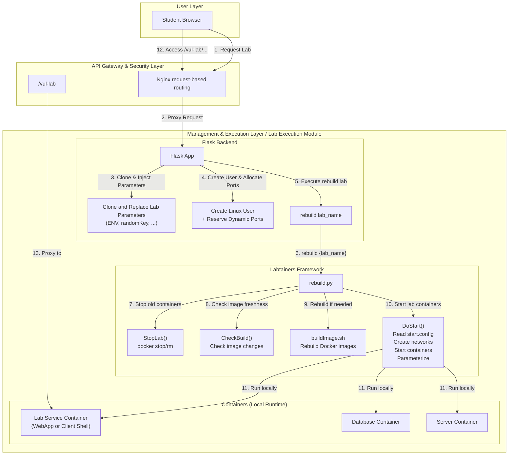
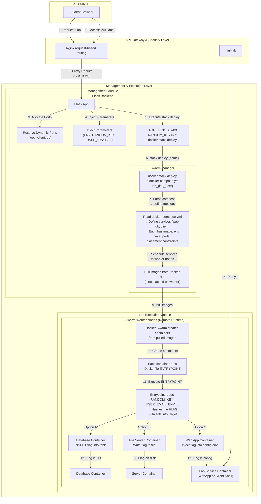

# Architecture Flow Diagrams

## Diagram 1: LABTAINER Flow

## Diagram 2: CUSTOM Flow

## Core Differences

| Aspect | LABTAINER | CUSTOM |
|---|---|---|
| **Orchestration** | Labtainers framework (`rebuild`) | Docker Swarm (`stack deploy`) |
| **Lab folder** | Cloned per-student | Shared template folder |
| **Container host** | Same machine as Flask | Remote Swarm worker node |
| **Terminal** | TTYD inside container (direct) | SSH → docker exec |
| **User isolation** | Linux user + `sg` group switch | Docker stack naming |
| **Image lifecycle** | Managed by rebuild.py | Managed by Swarm |
