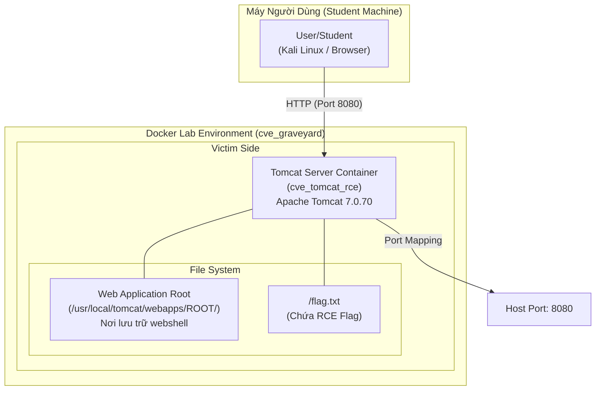
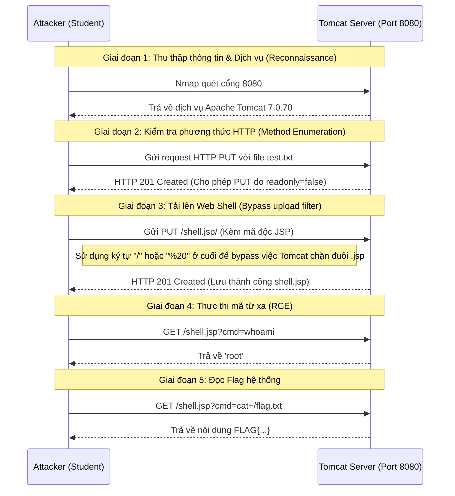

# 🏗️ Kiến Trúc Lab CVE Graveyard (Tomcat RCE)

## 1. Mô hình triển khai (Deployment Model)

Dưới đây là sơ đồ kiến trúc của bài lab, mô tả cách các thành phần kết nối với nhau trong môi trường Docker.

---

## 2. Luồng khai thác (Exploitation Flow)

Sơ đồ trình tự mô tả các giai đoạn tấn công từ khi thu thập thông tin đến khi tải lên được Webshell và đọc cờ ẩn.

---

## 3. Thành phần hệ thống

- **Web Server**: Sử dụng Apache Tomcat phiên bản 7.0.70 (có tồn tại lỗ hổng CVE-2017-12615).
- **Cấu hình lỗi**: Tham số `readonly` trong `conf/web.xml` bị quản trị viên đặt sai thành `false`, dẫn đến cho phép ghi đè/tạo tệp tùy ý qua phương thức HTTP PUT.
- **Port Mapping**: Port 8080 của container được map ra port 8080 của Host máy người dùng.
- **Dynamic Flag**: Flag nằm ở `/flag.txt` và được sinh ra tự động dựa trên ngày hiện tại và email cấu hình trong `docker-compose.yml`.
