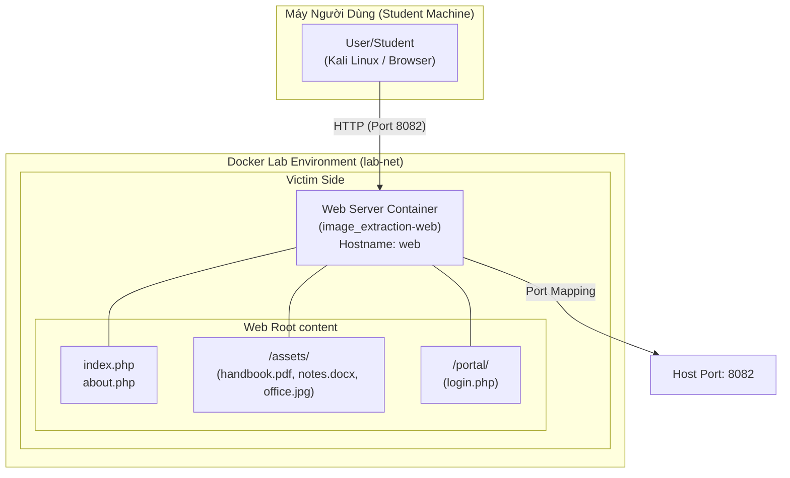
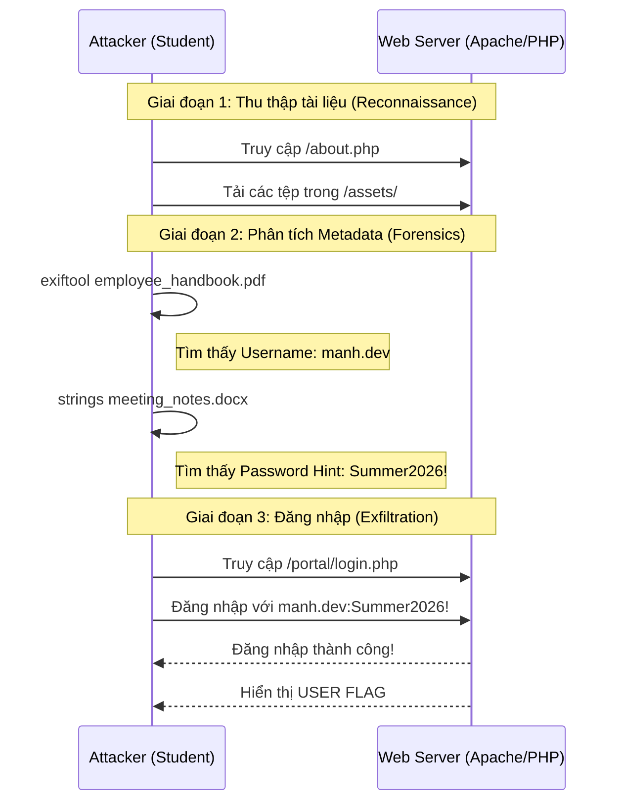

# 🏗️ Kiến Trúc Lab Image Extraction

## 1. Mô hình triển khai (Deployment Model)

---

## 2. Luồng khai thác (Exploitation Flow)

---

## 3. Thành phần hệ thống

- **Web Server**: PHP 8.2 Apache.
- **Port Mapping**: Host port 8082 -> Container port 80.
- **Dynamic Flag**: Dựa trên ngày và email cấu hình.
