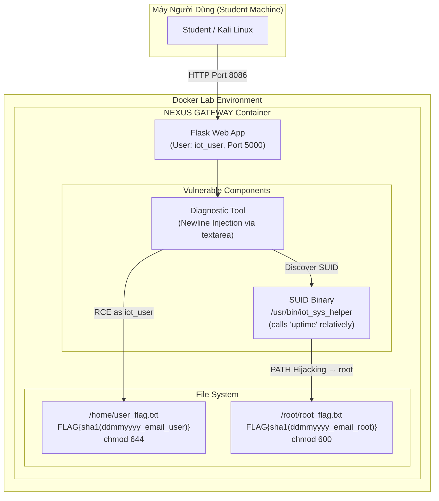

# 🏗️ Kiến Trúc Lab 4.2 Pro: The Mirai Target (Command Injection & PrivEsc)

## 1. Mô hình triển khai (Deployment Model)



---

## 2. Luồng khai thác (Exploitation Flow)

```mermaid
sequenceDiagram
    participant A as Attacker
    participant W as Web App (iot_user)
    participant S as SUID Binary (root)
    participant F as Root Flag

    Note over A, W: Giai đoạn 1: Bypass Filter & Command Injection
    A->>W: POST /login (admin / 123456)
    W-->>A: Session authenticated
    A->>W: POST /diagnostic (127.0.0.1 + ENTER + id)
    Note right of W: Filter blocks ; & | $ () {}
    Note right of W: Newline (Enter) không bị chặn!
    W-->>A: uid=1000(iot_user)
    A->>W: cat /home/user_flag.txt
    W-->>A: FLAG{...} ← User Flag

    Note over A, S: Giai đoạn 2: Privilege Escalation (PATH Hijacking)
    A->>W: find / -perm -4000 → /usr/bin/iot_sys_helper
    A->>W: Tạo /tmp/uptime (giả mạo lệnh 'uptime')
    A->>W: env PATH=/tmp:/usr/bin:/bin /usr/bin/iot_sys_helper
    W->>S: Chạy SUID binary
    S->>S: Gọi "uptime" → tìm theo PATH → /tmp/uptime
    S-->>A: Thực thi với quyền root!

    Note over A, F: Giai đoạn 3: Root Flag
    A->>F: cat /root/root_flag.txt
    F-->>A: FLAG{...} ← Root Flag
```

---

## 3. Cơ chế tạo Flag (Flag System)

| Stage | Loại | Suffix | Vị trí | Quyền |
|-------|------|--------|--------|-------|
| 1 | User Flag | `iot_command_injection_user` | `/home/user_flag.txt` | `iot_user` |
| 2 | Root Flag | `iot_command_injection_root` | `/root/root_flag.txt` | `root` only |

**Công thức:** `FLAG{sha1(ddmmyyyy_email@domain_suffix)}`

---

## 4. Thành phần hệ thống

| Thành phần | Chi tiết |
|------------|----------|
| **Base Image** | `python:3.9-slim` (Debian) |
| **Web Port** | `8086` (host) → `5000` (container) |
| **App User** | `iot_user` (uid=1000, không có sudo) |
| **Security Filter** | Regex chặn `;`, `&`, `\|`, `` ` ``, `$`, `(`, `)`, `{`, `}` |
| **Injection Bypass** | Ký tự **Newline** (Enter trong textarea) không bị chặn |
| **SUID Binary** | `/usr/bin/iot_sys_helper` - owner: root, mode: `-rwsr-xr-x` |
| **PrivEsc Method** | PATH Hijacking (lệnh `uptime` gọi không dùng đường dẫn tuyệt đối) |
