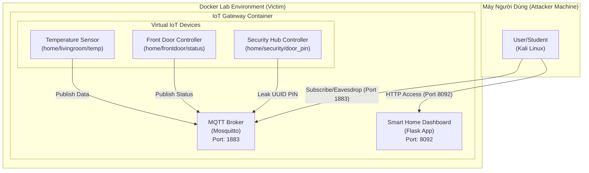
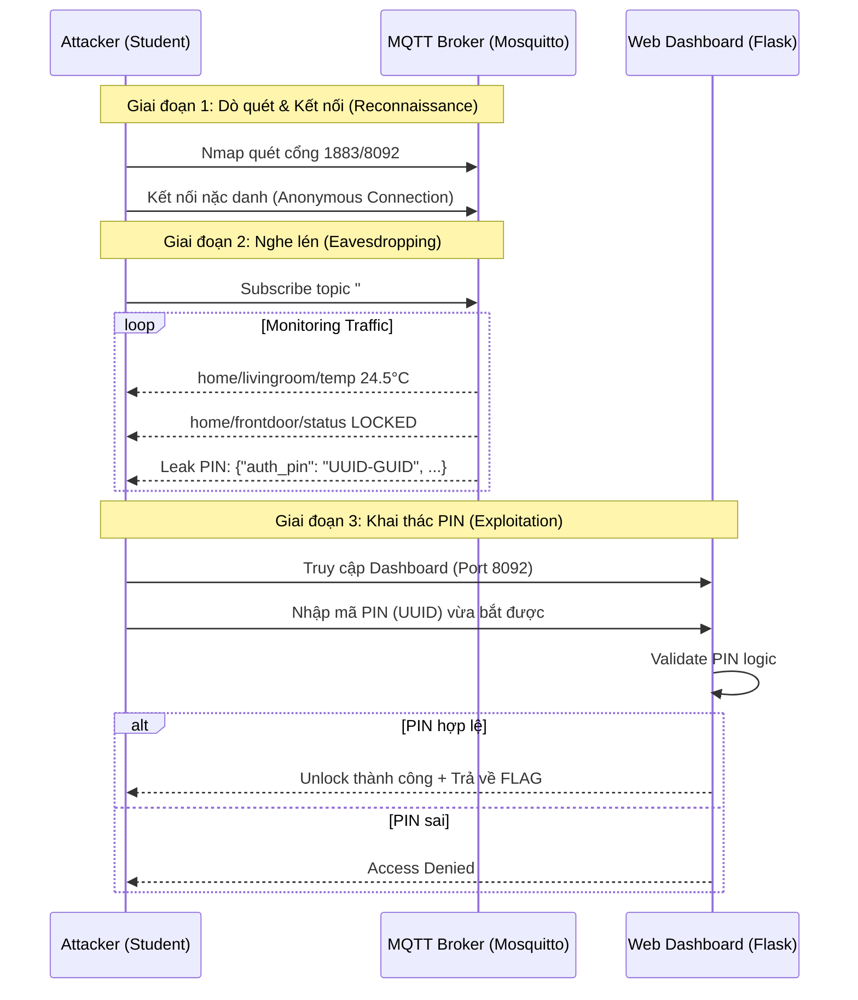

# 🏗️ Kiến Trúc Lab 4.1: The Chatty Smart Home

## 1. Mô hình triển khai (Deployment Model)

Dưới đây là sơ đồ kiến trúc của bài lab, mô tả cách các thành phần trong hệ thống Smart Home tương tác qua giao thức MQTT.

---

## 2. Luồng khai thác (Exploitation Flow)

Sơ đồ trình tự mô tả các giai đoạn tấn công từ khi nghe trộm gói tin MQTT đến khi chiếm được Flag qua giao diện Web.

---

## 3. Thành phần hệ thống

- **Eclipse Mosquitto**: MQTT Broker đóng vai trò trung tâm liên lạc. Cấu hình lỗi `allow_anonymous true` cho phép bất kỳ ai cũng có thể nghe trộm (Eavesdropping).
- **Virtual IoT Simulator**: Một tiến trình chạy ngầm liên tục gửi dữ liệu giả lập từ các cảm biến lên Broker, trong đó có lỗ hổng rò rỉ dữ liệu nhạy cảm (Information Disclosure).
- **Flask Web Interface**: Giao diện điều khiển Smart Home hiện đại, được bảo vệ bằng mã PIN UUID linh hoạt.
- **Dynamic Flag**: Flag được sinh ra động dựa trên Email người dùng và ngày hiện tại, đảm bảo tính duy nhất.
