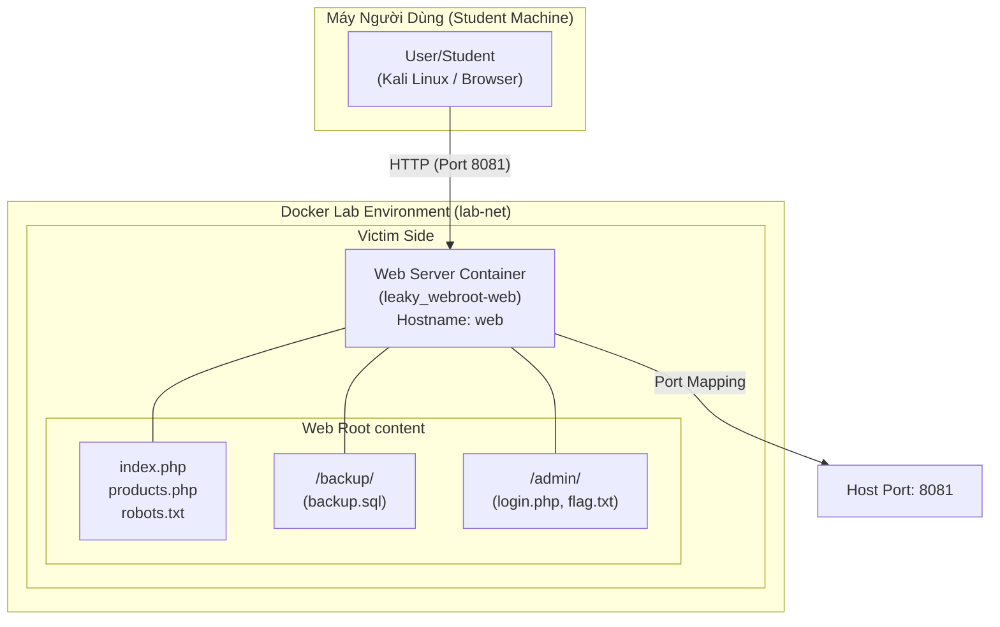
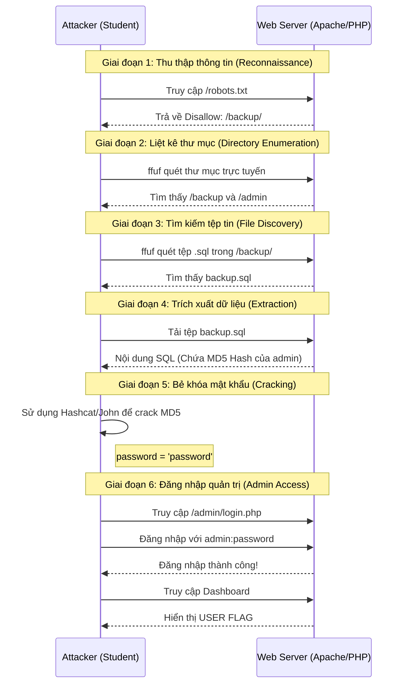

# 🏗️ Kiến Trúc Lab Leaky Webroot

## 1. Mô hình triển khai (Deployment Model)

Dưới đây là sơ đồ kiến trúc của bài lab, mô tả cách các thành phần kết nối với nhau trong môi trường Docker.

---

## 2. Luồng khai thác (Exploitation Flow)

Sơ đồ trình tự mô tả các giai đoạn tấn công từ khi thu thập thông tin đến khi lấy được Flag.

---

## 3. Thành phần hệ thống

- **Web Server**: Sử dụng PHP 8.2 trên nền Apache.
- **Port Mapping**: Port 80 của container được map ra port 8081 của Host máy người dùng.
- **Dynamic Flag**: Flag được sinh ra tự động dựa trên ngày và email cấu hình trong `docker-compose.yml`.
